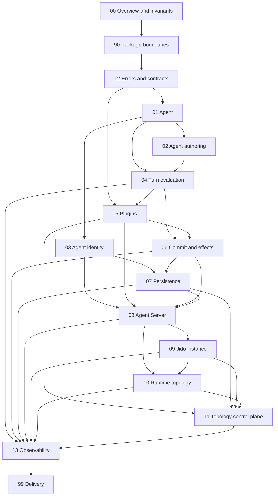

# Design documentation instructions

These instructions apply to all files in `docs/design`.

## Review status

The **Document review status** table in `README.md` is the source of truth for
user approval. Design maturity labels such as `Proposal`, `Locked for Jido
core`, or `Proposed decision` do not mean that the user approved a document.

Use only these review values:

- `Pending approval`
- `Approved`

When an agent changes a design document, the agent must set that document's
row to `Pending approval` before it finishes the task. This rule applies to all
changes, including small editorial changes.

When an agent adds a design document, the agent must add it to the table with
`Pending approval`.

An agent must not set a document to `Approved` unless the user explicitly
names that document as approved. Do not infer approval from general positive
feedback or from a request to continue.

Changing only the review-status table does not reset the review status of
`README.md`. Any other agent change to `README.md` resets its row to `Pending
approval`.

## EARS requirements

Use EARS, the Easy Approach to Requirements Syntax, when a design document
specifies required behavior. This rule applies to target contracts, alignment
plans, acceptance matrices, migration gates, and approved invariants.

Use one of these forms:

```text
<SEAM>-REQ-<number>: The <owner> shall <required response>.
<SEAM>-REQ-<number>: When <trigger>, the <owner> shall <required response>.
<SEAM>-REQ-<number>: While <state>, the <owner> shall <required response>.
<SEAM>-REQ-<number>: If <unwanted condition>, then the <owner> shall <required response>.
<SEAM>-REQ-<number>: Where <feature is enabled>, the <owner> shall <required response>.
<SEAM>-REQ-<number>: Where <feature>, while <state>, when <trigger>, the <owner> shall <required response>.
```

Use the combined form only when a simple form cannot state the requirement.

Follow these rules:

1. Give each requirement one stable and unique identifier.
2. Use one observable behavior in each requirement.
3. Name the Jido component that owns the response.
4. Use `shall` only for required target behavior.
5. Keep current facts, recommendations, and approved requirements separate.
6. Define vague terms with measurable limits or remove them.
7. Link each requirement to current evidence or a required acceptance test.
8. Keep requirement identifiers stable when wording changes. Retire an
   identifier instead of assigning it to a different behavior.

These examples show syntax only. They are not approved decisions:

```text
AGT-REQ-001: The Agent shall include Plugin-owned state in its complete state map.
TURN-REQ-001: When Turn evaluation selects an executable, the Turn evaluator shall use that executable for the complete Turn.
PERS-REQ-001: If a compare-and-swap result is indeterminate, then the Agent Server shall stop further persistent writes.
```

EARS syntax does not grant approval. Apply the review-status rules in this
file.

## Alignment dependency order

Use this graph when you prepare alignment documents. An arrow points from a
prerequisite seam to a seam that depends on it. Finalize the required
contracts in the prerequisite seam before you finalize the dependent seam.



This graph defines the minimum planning gates. It does not list every code
dependency. A seam can refer to a later seam, but it must not decide the later
seam's owned contract.

Each alignment document must:

1. Read the canonical code, the seam design, and the seam gap analysis.
2. State which prerequisite alignment documents it used.
3. List unresolved prerequisite decisions as blockers or explicit assumptions.
4. Define an ordered plan to move from current behavior to the approved design.
5. Preserve current public behavior unless the plan includes a clear migration.
6. Define tests or other evidence for each alignment step.

## Seam document pattern

Follow [the seam template](SEAM_TEMPLATE.md). Each seam has three documents by
default:

- `README.md` is the short briefing and review entry point.
- `design.md` contains the target contract and EARS requirements.
- `alignment.md` contains current evidence, the gap register, the ordered plan,
  migration work, and the acceptance matrix.

Do not create separate `briefing.md`, `gap-analysis.md`, or `evidence.md` files.
Fold that content into the three standard documents. A supporting topic
document is permitted only when it defines a large independent contract.

Put each fact in one place. Link to it from the other documents. Keep the
briefing at 1,200 words or less. The briefing must not introduce a contract
that is absent from `design.md`. The alignment plan must not treat a briefing
recommendation as approved.

Each seam README must contain a `Major gaps and work remaining` section. Keep
this section short. State outcomes and owner seams. Do not list implementation
tasks.

The alignment document can define high-level work packages and dependency
gates. It must not become the formal implementation plan. Create that plan
with `ce-plan` only after the user approves the seam intent and requirements.

Add each new document to the main review-status table with `Pending approval`.
Keep current facts, recommended decisions, and approved decisions distinct.

Do not prepare dependent seams fully in parallel. Work in graph order. If a
prerequisite alignment changes, review each dependent alignment again.
