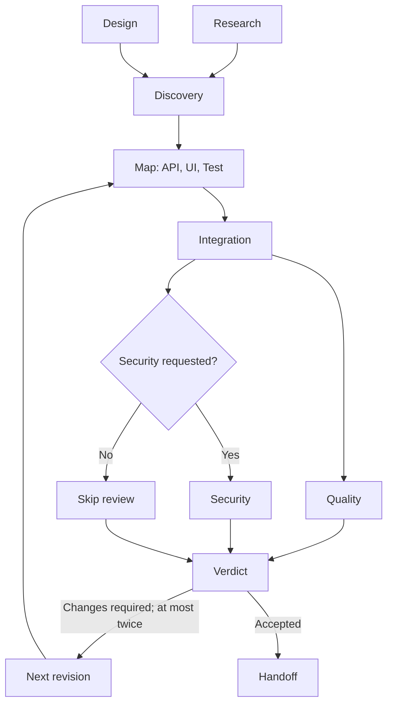

# 06_04 Flow Factory

A Mission Agent owns nine worker Agents while a Plugin runs one large Flow that
builds, reviews, repairs, and hands off a software proposal.

## What you will learn

- How a Plugin owns an asynchronous Exec handle after the mission Turn commits.
- How nested Flows, Map, Choice, and bounded Iterate coordinate real Agent work.

## Read the code

Read [the Mission Agent](mission.ex), [the Pipeline](pipeline.ex),
[the worker and writer port](worker.ex), then [the Runner Plugin](runner.ex) and
[contracts](contract.ex).

## Run it

```sh
mix test test/examples/06_factory/06_04_flow_factory --include example --seed 0
```

Expected result: the local writer produces an initial quality finding, one
repair uses that finding, revision one is accepted, and all workers stop.

Run the optional local demonstration:

```sh
mix run examples/06_factory/06_04_flow_factory/demo.exs
```

## Work graph



## Important behavior

Workers commit each artifact before the Flow reads it. Assignment IDs, input
hashes, role, and revision reject stale or changed results. Failure,
cancellation, deadline, or owner shutdown cancels the Flow and stops the worker
tree. The writer is a runtime service port; deterministic and live adapters do
not enter Agent state.

## Limits

Completed provider calls and worker commits are not rolled back when the Flow
fails. This in-memory example does not checkpoint or resume an active Flow.
Progress casts are best effort and do not have delivery replay.

## Files

- [Mission Agent](mission.ex)
- [Pipeline](pipeline.ex)
- [Worker and writer port](worker.ex)
- [Runner Plugin](runner.ex)
- [Contracts](contract.ex)
- [Tests](../../../test/examples/06_factory/06_04_flow_factory/flow_factory_test.exs)

Previous: [Department Factory](../06_03_department_factory/README.md) | Next: [Independent Topology](../../07_topology/07_01_independent/README.md)
