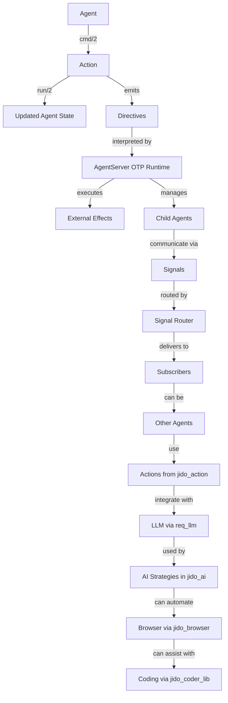
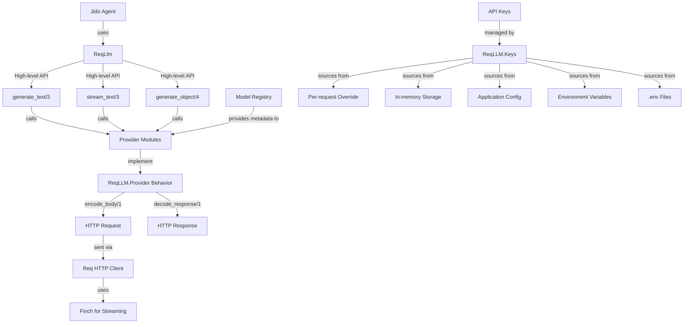
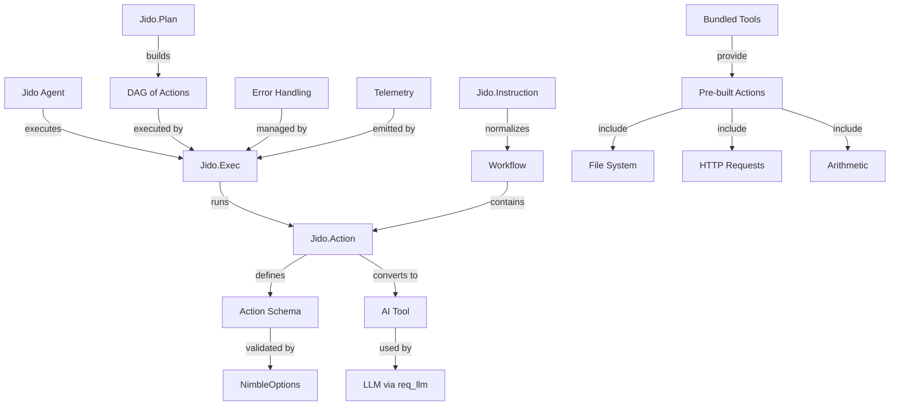
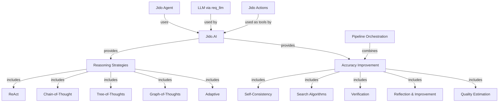
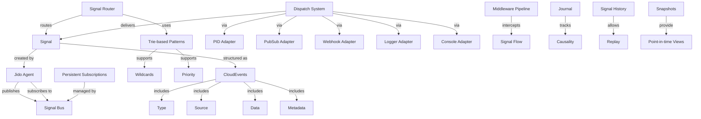
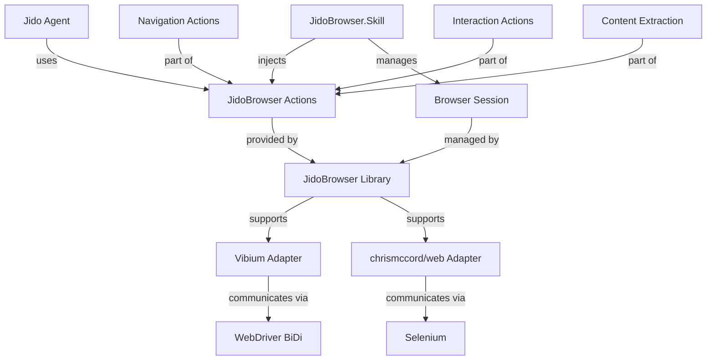
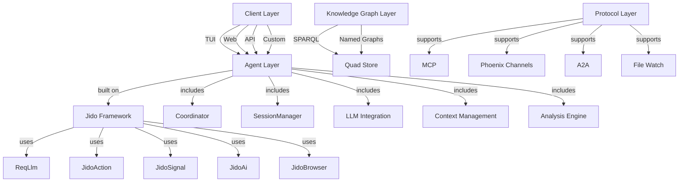
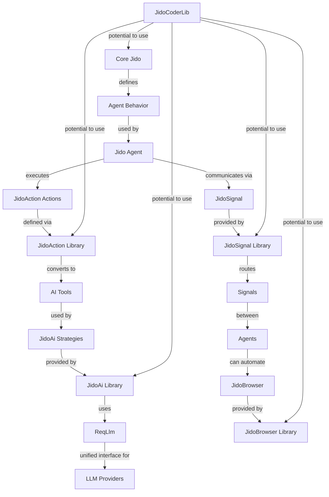

# Comprehensive Overview of the Jido Agentic Ecosystem

## Overview of the Jido Ecosystem

The Jido ecosystem represents a sophisticated, modular framework for building autonomous agent systems in Elixir, leveraging the BEAM VM's concurrency and fault-tolerance capabilities. At its core, the ecosystem embodies a functional approach to agent design, where agents are immutable data structures with a single command function that transforms state and generates directives for side effects. This architecture ensures deterministic agent logic, testability without processes, and a clear path to production deployment through OTP integration.

The name "Jido" (自動) derives from the Japanese word for "automatic" or "automated," reflecting the framework's emphasis on autonomous behavior. The ecosystem is designed around the core Jido Agent behavior, with several opt-in packages extending this core functionality. These packages include `req_llm` for LLM API interactions, `jido_action` for composable actions, `jido_ai` for AI/LLM integration, `jido_signal` for event-driven communication, `jido_browser` for browser automation, and `jido_coder_lib` for coding assistance. Each library addresses a specific aspect of agent development, from low-level communication to high-level reasoning strategies, creating a comprehensive toolkit for building complex, distributed agent systems.

The ecosystem's design philosophy emphasizes composability, validation, and standardization. By providing structured formats for actions, signals, and directives, Jido abstracts away the complexities of raw OTP primitives, allowing developers to focus on agent logic rather than infrastructure. This formalization of patterns—such as using Signals for inter-agent communication, Actions for reusable operations, and Directives for effect descriptions—enables scalable, maintainable, and observable agent systems.

## Core Framework: Jido

Jido serves as the foundational framework for the entire ecosystem, providing the primitives necessary to build autonomous, distributed agent systems in Elixir. It formalizes common patterns found in multi-agent OTP applications, such as standardized message envelopes, reusable command patterns, typed effect descriptions, and lifecycle management, into a cohesive agent behavior built on GenServer. This approach allows developers to leverage Elixir's concurrency model while avoiding the need to reinvent solutions for ad-hoc message shapes, business logic mixing, implicit effects, and custom child tracking.

The core architecture of Jido revolves around the `cmd/2` contract, where an agent and an action are passed as inputs, and the function returns an updated agent along with a list of directives. This contract ensures that state changes are pure data transformations, while side effects are described as directives to be executed by an OTP runtime. The immutability of agents and the separation of state transformations from effect execution provide several benefits, including deterministic agent logic, ease of testing without processes, and a clear mental model for understanding agent behavior.

Jido's key features include an immutable agent architecture inspired by Elm/Redux, directive-based effects, OTP runtime integration, composable skills, execution strategies, and multi-agent orchestration. Agents are defined with a schema-validated state, and actions are implemented as modules that conform to the Jido.Action behavior. Directives, such as `Emit`, `Spawn`, `SpawnAgent`, and `Stop`, describe external effects and are executed by the AgentServer, which is a GenServer-based runtime for production deployment.

The framework also supports various execution strategies, including direct execution for simple workflows and finite state machine (FSM) strategies for state-driven workflows. This extensibility allows developers to implement custom execution patterns tailored to their specific use cases. Additionally, Jido provides built-in support for parent-child agent hierarchies, signal routing with configurable strategies, and instance-scoped supervision for multi-tenant deployments.

### Core Concepts

The `cmd/2` contract is the fundamental operation in Jido, embodying the framework's functional approach to agent design. It takes an agent and an action as inputs and returns an updated agent along with a list of directives. This contract ensures that the returned agent is always complete, with no need for an "apply directives" step, and that directives describe only external effects, never modifying agent state. The purity of `cmd/2` guarantees that the same inputs will always produce the same outputs, facilitating predictable and testable agent behavior.

Actions, directives, and state operations form the triad of Jido's core abstractions. Actions transform state and may perform side effects, executed by `cmd/2` to update `agent.state`. Directives, on the other hand, are bare structs emitted by agents that describe external effects, interpreted by the runtime (AgentServer). State operations, such as `SetState`, `ReplaceState`, and `DeleteKeys`, describe internal state transitions handled by the strategy layer during `cmd/2` and never reach the runtime.

State operations (`Jido.Agent.StateOp`) are internal state transitions applied by the strategy layer. They include operations like deep merging attributes into state (`SetState`), replacing state wholesale (`ReplaceState`), removing top-level keys (`DeleteKeys`), and setting or deleting values at nested paths (`SetPath`, `DeletePath`). These operations enable precise control over an agent's state without involving the runtime, ensuring that state transformations remain pure and deterministic.

Directives, in contrast, are effect descriptions that the runtime executes. They include `Emit` for dispatching signals, `Error` for signaling errors from `cmd/2`, `Spawn` for spawning generic BEAM child processes, `SpawnAgent` for spawning child Jido agents with hierarchy tracking, `StopChild` for gracefully stopping tracked child agents, `Schedule` for delayed messages, and `Stop` for stopping the agent process. By separating state transformations from effect descriptions, Jido maintains a clear boundary between pure logic and side effects, enhancing testability and reasoning about agent behavior.

### Ecosystem Integration

Jido's design as the core package of the ecosystem allows it to integrate seamlessly with other libraries, each extending its capabilities in specific domains. For instance, `jido_signal` provides the standardized message envelopes (Signals) that agents use for communication, while `jido_action` offers composable, validated actions that agents can execute. The `req_llm` library enables agents to interact with LLM APIs through a unified interface, and `jido_ai` implements advanced reasoning strategies and accuracy improvement techniques. `jido_browser` equips agents with browser automation capabilities, and `jido_coder_lib` provides a foundation for coding assistance agents.

This modular architecture allows developers to opt-in to only the packages they need, keeping their applications lightweight and focused. The core Jido framework defines the abstractions and protocols that these packages implement, ensuring interoperability and consistency across the ecosystem. For example, actions defined with `jido_action` can be seamlessly used as tools in `jido_ai`'s reasoning strategies, and signals from `jido_signal` can be routed and dispatched by Jido's runtime to coordinate multi-agent workflows.

### Mermaid Diagram: Jido Core Architecture

This diagram illustrates the core Jido architecture, where agents process actions to update state and generate directives. The AgentServer runtime interprets these directives to execute external effects and manage child agents. Agents communicate via Signals, which are routed by the Signal Router to subscribers, including other agents. These agents can use actions from `jido_action`, integrate with LLMs via `req_llm`, employ AI strategies from `jido_ai`, automate browsers with `jido_browser`, and assist with coding using `jido_coder_lib`.

## Unified LLM Interface: ReqLlm

ReqLlm is a crucial component of the Jido ecosystem, providing a unified, idiomatic Elixir interface for interacting with various LLM APIs. It addresses the inconsistency of LLM APIs by standardizing requests and responses across multiple providers, such as Anthropic, OpenAI, Google, Groq, and others. This standardization simplifies the integration of LLM capabilities into Jido agents, allowing developers to switch between providers or use multiple providers without significant code changes.

The library employs a two-layer architecture: a high-level API inspired by Vercel AI SDK, offering functions like `generate_text/3`, `stream_text/3`, and `generate_object/4` that work uniformly across providers; and a low-level API that provides direct Req plugin access for full HTTP control. The high-level API is designed for ease of use, with minimal configuration required, while the low-level API allows for advanced customization and integration with existing Req-based applications.

ReqLlm also includes a provider-agnostic model registry, auto-synced from models.dev, which includes metadata for over 665 models across 45 providers. This metadata covers costs, context lengths, modalities, capabilities, and deprecation status, enabling informed model selection and usage tracking. The library's canonical data model comprises typed structs for Context, Message, ContentPart, Tool, StreamChunk, Response, and Usage, all implementing `Jason.Encoder` for straightforward persistence and inspection.

Structured object generation is another key feature, with `generate_object/4` rendering JSON-compatible Elixir maps validated by NimbleOptions-compiled schemas. This feature supports zero-copy mapping to provider JSON-schema or function-calling endpoints, and OpenAI native structured outputs with modes like `:auto`, `:json_schema`, and `:tool_strict`. Additionally, ReqLlm supports provider-specific capabilities, such as Anthropic's web search for real-time content access, extended thinking/reasoning, and prompt caching for cost optimization.

Production-grade streaming is implemented using Finch directly, due to known Req limitations with SSE responses. The `stream_text/3` function returns a `StreamResponse` with both real-time tokens and async metadata, leveraging HTTP/2 multiplexing and automatic connection pooling. Usage and cost tracking are built-in, with every response including detailed token counts and USD costs calculated from model metadata or provider invoices. Telemetry events for token usage are published, facilitating monitoring and cost management.

### API Key Management and Configuration

ReqLlm offers flexible, layered API key management, supporting per-request overrides, in-memory storage, application configuration, environment variables, and .env files. This multi-source approach with clear precedence ensures that key management is both secure and adaptable to various deployment scenarios. Keys can be stored in memory using `ReqLLM.put_key/2` and retrieved with source information via `ReqLLM.get_key/1`. All public functions accept an `api_key` parameter for overriding stored keys, providing granular control over authentication.

By default, ReqLLM loads `.env` files from the current working directory at startup, which can be disabled by setting `config :req_llm, load_dotenv: false` in the application configuration. This behavior simplifies development by allowing developers to manage API keys in a local `.env` file, while production deployments can rely on environment variables or other secure mechanisms.

The library's configuration also extends to streaming, where it uses Finch for streaming connections with automatic connection pooling. The default configuration employs HTTP/1-only pools to work around a known Finch bug with large request bodies in HTTP/2 pools. Advanced users can configure HTTP/2 pools if they know their prompts will be small, or increase connection counts for high-scale deployments with small prompts. Custom Finch instances can be specified per request for further flexibility.

### Provider Integration and Extensibility

ReqLlm uses OpenAI Chat Completions as the baseline API standard, with providers that support this format requiring minimal overrides using the `ReqLLM.Provider.DSL`. Model metadata is automatically synced from models.dev, and providers implement the `ReqLLM.Provider` behavior with functions like `encode_body/1`, `decode_response/1`, and optional parameter translation via `translate_options/3`. This design makes it straightforward to add new providers or extend existing ones, contributing to the library's comprehensive coverage of LLM providers.

The low-level Req plugin API allows for advanced use cases, giving developers full control over the Req pipeline. This approach enables the addition of custom middleware, modification of requests, or integration with existing Req-based applications. The canonical pattern used by `ReqLLM.generate_text/3` demonstrates how to parse model specifications, retrieve provider modules, prepare requests, and execute HTTP requests, providing a clear blueprint for custom integrations.

### Mermaid Diagram: ReqLlm Architecture

This diagram illustrates ReqLlm's architecture, showing how Jido agents use the high-level API functions like `generate_text/3`, `stream_text/3`, and `generate_object/4`. These functions call provider modules that implement the `ReqLLM.Provider` behavior, encoding requests and decoding responses. The Req HTTP client, using Finch for streaming, handles the actual HTTP communication. The model registry provides metadata to provider modules, and API keys are managed by `ReqLLM.Keys`, which sources keys from various locations with clear precedence.

## Composable Actions: JidoAction

Jido.Action is a framework for building composable, validated actions in Elixir, designed to provide a standardized way to define discrete units of functionality that can be composed into complex workflows. It addresses the need for structured operations in Elixir's dynamic world by offering compile-time and runtime validation using NimbleOptions schemas, AI tool integration, workflow composition, parameter validation, consistent error handling, and runtime introspection. This framework is particularly useful for microservices, agent-based systems, and AI-powered applications that require reliable function calling.

The primary motivation for Jido.Action stems from the limitations of traditional Elixir functions when building complex applications. Raw function calls lack structure, validation, and metadata, making it challenging to integrate with AI systems, compose workflows, ensure parameter correctness, handle errors consistently, or introspect available operations at runtime. Jido.Action transforms these ad-hoc functions into structured, validated, AI-compatible operations that scale from simple tasks to complex agent workflows.

Key features of Jido.Action include structured action definition with compile-time configuration validation and runtime parameter validation, AI tool integration with automatic conversion to LLM-compatible tool formats, a robust execution engine via `Jido.Exec` supporting synchronous and asynchronous execution with retries and timeouts, workflow composition via `Jido.Instruction` for building complex operations, and a comprehensive tool library with over 25 pre-built actions for common operations.

### Core Components

Jido.Action, the foundational behavior, provides the mechanisms for defining structured, validated actions. It includes compile-time configuration validation, parameter and output schemas with validation, lifecycle hooks for customization, automatic AI tool format generation, and JSON serialization support. Actions are defined using the `use Jido.Action` macro, specifying metadata such as name, description, category, tags, version, and schema for parameters. The `run/2` function implements the action's logic, receiving validated parameters and a context map, and returning either `{:ok, result}` or `{:error, reason}`.

Jido.Exec serves as the execution engine for running actions reliably. It supports both synchronous and asynchronous execution, automatic retries with exponential backoff, timeout handling and process monitoring, comprehensive error handling, telemetry integration for monitoring, and instance isolation for multi-tenant applications. The `run/3` function executes an action synchronously, while `run_async/3` returns an asynchronous reference that can be awaited using `await/2`. This engine ensures that actions are executed in a controlled environment, with mechanisms to handle failures and monitor performance.

Jido.Instruction provides the workflow composition system, enabling the definition of complex operations from multiple actions. It supports multiple input formats (modules, tuples, structs), parameter normalization and validation, context sharing across actions, and action allowlist validation. The `normalize/2` function converts a list of instructions into a normalized format, merging shared context and validating each instruction. This system allows for the creation of sophisticated workflows by chaining actions, conditionally executing them based on previous results, or running them in parallel.

Jido.Plan offers DAG-based execution planning for complex workflows, featuring a directed acyclic graph of action dependencies, parallel execution phases based on dependency analysis, a builder pattern for constructing plans, and cycle detection and validation. This component is particularly useful for workflows where certain actions must wait for others to complete, enabling efficient parallelization where possible while ensuring correct execution order.

### Bundled Tools and Advanced Features

Jido.Action comes with a comprehensive library of pre-built tools organized by category, covering core utilities, arithmetic operations, file system operations, HTTP operations, external API integration, workflow and simulation, and specialized tools like branching and parallel execution. These tools provide ready-to-use actions for common tasks, reducing the need for developers to implement basic functionality from scratch.

Advanced features include error handling and compensation, lifecycle hooks, and telemetry integration. Actions can define compensation logic to handle errors gracefully, with options for enabling compensation, setting maximum retries, and specifying timeouts. Lifecycle hooks, such as `on_before_validate_params/1`, `on_after_validate_params/1`, and `on_after_run/1`, allow customization of action behavior at various stages of execution. Telemetry integration enables monitoring of action execution, with events published for action start and stop, facilitating observability and performance analysis.

### Mermaid Diagram: JidoAction Components

This diagram shows how Jido agents use `Jido.Exec` to run actions defined with `Jido.Action`. Actions have schemas validated by NimbleOptions and can be converted to AI tools for use with LLMs via `req_llm`. `Jido.Instruction` normalizes workflows containing multiple actions, and `Jido.Plan` builds DAGs of actions for complex execution patterns. Bundled tools provide pre-built actions for file system operations, HTTP requests, arithmetic, and more. Error handling is managed by `Jido.Exec`, and telemetry is emitted for monitoring.

## AI Integration Layer: JidoAi

Jido.AI serves as the AI integration layer within the Jido ecosystem, providing a comprehensive toolkit for improving LLM output quality through proven accuracy enhancement techniques. It implements research-backed algorithms for self-consistency, search, verification, reflection, and more, all designed to get better results from language models. This library is essential for building intelligent agents that can reason, plan, and interact with external tools effectively.

The library offers a variety of reasoning strategies, such as ReAct (Reason-Act loop) for tool-using agents, Chain-of-Thought for sequential reasoning, Tree-of-Thoughts for exploring multiple paths, Graph-of-Thoughts for networked reasoning, and Adaptive for dynamic strategy selection. These strategies form the foundation of intelligent agent behavior, allowing agents to approach problems in structured and effective ways.

Beyond reasoning strategies, Jido.AI provides accuracy improvement techniques organized by how they enhance results. Consensus-based methods like Self-Consistency and Adaptive Self-Consistency generate multiple candidates and aggregate results for more reliable answers. Search algorithms such as Beam Search, MCTS (Monte Carlo Tree Search), and Diverse Decoding systematically explore the reasoning space to find optimal solutions. Verification techniques, including LLM Verifier, Code Execution, Deterministic, Static Analysis, and Unit Test, validate outputs before accepting them, catching hallucinations and errors.

Reflection & Improvement techniques like Self-Refine, Reflection Stages, and Critique & Revision iteratively refine outputs through self-critique and revision. Quality Estimation methods, such as Confidence Calibration, Difficulty Estimation, and Process Reward Models, estimate confidence and difficulty to allocate resources appropriately. Finally, pipeline orchestration allows combining multiple techniques into powerful workflows that adapt to specific needs.

### Reasoning Strategies

Reasoning strategies in Jido.AI determine how an LLM approaches a problem. The ReAct strategy, for example, interleaves reasoning and acting, making it ideal for agents that need to use tools or APIs. It follows a loop where the agent thinks about what to do, selects an action, executes it, observes the result, and repeats until the goal is achieved. This strategy is implemented via the `Jido.AI.ReActAgent` behaviour, which allows agents to be defined with a set of tools and a model specification.

Chain-of-Thought strategy encourages the LLM to generate a sequence of intermediate reasoning steps, which is particularly effective for multi-step reasoning problems and mathematical tasks. By breaking down the problem into smaller, manageable steps, the LLM can arrive at the correct solution more reliably. Tree-of-Thoughts explores multiple reasoning paths simultaneously, allowing the agent to consider different approaches and select the most promising one. This is useful for complex planning tasks where there might be multiple valid solutions.

Graph-of-Thoughts models reasoning as a network of interconnected concepts, enabling the agent to handle problems with complex relationships and dependencies. This strategy is suitable for tasks where understanding the connections between different pieces of information is crucial. The Adaptive strategy dynamically selects the most appropriate reasoning strategy based on the problem at hand, providing flexibility and robustness across a wide range of tasks.

### Accuracy Improvement Techniques

Jido.AI's accuracy improvement techniques are designed to enhance the quality and reliability of LLM outputs. Self-Consistency, for instance, generates multiple diverse reasoning paths and aggregates their results by majority voting, which is particularly effective for problems with definite answers like math or logic puzzles. Adaptive Self-Consistency builds on this by dynamically allocating resources based on the difficulty of the problem, ensuring that more computational effort is spent on harder problems.

Search algorithms like Beam Search maintain a set of the most promising candidates at each step, allowing for focused exploration without getting bogged down in less likely paths. MCTS, inspired by its success in game-playing AI, uses Monte Carlo simulations to explore the reasoning space, balancing exploration and exploitation to find optimal solutions. Diverse Decoding techniques promote the generation of a variety of responses, which is useful for brainstorming or creative tasks.

Verification techniques play a critical role in ensuring the correctness of LLM outputs. LLM Verifier uses another LLM to check the validity of the generated response. Code Execution verifier executes generated code to verify its correctness, which is invaluable for programming or mathematical problems. Deterministic verifiers check outputs against known answers or test cases, while Static Analysis verifiers examine code quality without execution. Unit Test verifiers run generated code against a suite of tests to ensure it meets specified requirements.

Reflection & Improvement techniques enable iterative refinement of outputs. Self-Refine generates an initial draft and then critiques and revises it to improve quality. Reflection Stages involve multiple stages of reflection and revision, each focusing on different aspects of the output. Critique & Revision provides a structured approach to improvement, with explicit critique and revision steps.

Quality Estimation techniques help in making informed decisions about resource allocation. Confidence Calibration assesses the reliability of the LLM's output, providing a confidence score that can be used to decide whether to accept the output or seek further verification. Difficulty Estimation predicts the complexity of a problem, allowing the system to allocate more resources to harder problems. Process Reward Models evaluate the quality of each step in a multi-step reasoning process, providing fine-grained feedback.

### Pipeline Orchestration

Pipeline orchestration in Jido.AI allows combining multiple accuracy improvement techniques into cohesive workflows that adapt to the specific requirements of each task. A pipeline can include steps for difficulty estimation, strategy selection, generation, verification, and refinement. By dynamically adjusting the pipeline based on intermediate results, the system can optimize for both accuracy and efficiency.

For example, a pipeline might start by estimating the difficulty of a problem. If the problem is deemed easy, it might use a fast, direct generation approach. For harder problems, it might employ a more sophisticated strategy like Tree-of-Thoughts with Self-Consistency and verification. The pipeline can also include reflection stages to refine the output and quality estimation to assess the final result's confidence.

### Mermaid Diagram: JidoAi Architecture

This diagram illustrates the architecture of Jido.AI, showing how Jido agents use the library to access various reasoning strategies and accuracy improvement techniques. Reasoning strategies include ReAct, Chain-of-Thought, Tree-of-Thoughts, Graph-of-Thoughts, and Adaptive. Accuracy improvement techniques encompass Self-Consistency, Search Algorithms, Verification, Reflection & Improvement, and Quality Estimation. Pipeline orchestration combines these techniques into adaptive workflows. The library integrates with LLMs via `req_llm` and uses Jido Actions as tools for reasoning strategies.

## Event-Driven Communication: JidoSignal

Jido.Signal is a sophisticated toolkit for building event-driven and agent-based systems in Elixir, providing a complete ecosystem for defining, routing, dispatching, and tracking signals throughout an application. Built on the CloudEvents v1.0.2 specification with powerful Jido-specific extensions, it addresses the limitations of raw Elixir message passing by offering a standardized message format, event routing, conversation tracking, reliable delivery, and cross-system integration.

The primary motivation for Jido.Signal stems from the challenges of building complex systems with Elixir's native message passing mechanisms like `send/2` and `GenServer.cast/call`. While these are effective for simple scenarios, they lack structure, metadata, routing capabilities, and reliability for more sophisticated applications. Jido.Signal transforms Elixir's message passing into a robust communication system that scales from simple GenServer interactions to complex multi-agent orchestration across distributed systems.

Key features of Jido.Signal include a standardized signal structure compliant with CloudEvents v1.0.2, a high-performance signal bus with in-memory GenServer-based pub/sub, persistent subscriptions with checkpointing and retry mechanisms, an advanced routing engine with trie-based pattern matching, a pluggable dispatch system supporting multiple delivery adapters, and comprehensive causality & conversation tracking. These features enable developers to build observable, traceable, and scalable event-driven architectures.

### Core Concepts

The Signal is the central abstraction in Jido.Signal, representing a CloudEvents-compliant message envelope that carries application events. Signals can be created using a positional constructor (type, data, attrs) or a map/keyword constructor for backward compatibility. They include metadata such as type, source, data, and optional extensions for custom attributes. Custom signal types can be defined with validation schemas, ensuring that signals adhere to specific data structures and requirements.

The Signal Bus provides the pub/sub mechanism for signal communication. It is implemented as a GenServer and supports features like persistent subscriptions, middleware pipelines, signal history with replay capabilities, and snapshots for point-in-time views. Subscriptions can be configured with various options, including dispatch modes (PID, PubSub, HTTP, Logger, Console), max in-flight signals, retry attempts, and retry intervals. The bus also supports instance isolation for multi-tenant deployments, allowing separate signal infrastructures for different tenants or testing environments.

The Router component handles signal routing based on pattern matching. It uses a trie-based data structure for optimal performance and supports wildcards (`*` for single-level, `**` for multi-level), priority-based execution ordering, and custom pattern matching functions. Routes are defined as a list of patterns and corresponding handlers, enabling flexible and efficient signal distribution to interested subscribers.

The Dispatch system manages the delivery of signals to multiple destinations. It supports various adapters, including PID for direct process delivery, PubSub for Phoenix.PubSub integration, Webhook for HTTP requests with signature verification, Logger for structured logging, and Console for pretty-printed output. Dispatch can be synchronous or asynchronous, with configurable timeouts and retry mechanisms. A circuit breaker wrapper using `:fuse` provides fault isolation for external services.

### Advanced Features

Persistent subscriptions ensure reliable signal processing by tracking acknowledgments and implementing retry mechanisms with Dead Letter Queues (DLQ) for failed signals. This guarantees that signals are not lost even if a subscriber crashes or is temporarily unavailable. Subscribers can acknowledge successful processing, and the bus will retry delivery up to a configured number of attempts before moving the signal to a DLQ.

The middleware pipeline allows adding cross-cutting concerns like logging, authentication, and metrics to signal processing. Middleware modules can define callbacks such as `before_publish`, `after_publish`, `before_dispatch`, and `after_dispatch`, which are executed with timeout protection to prevent slow middleware from blocking the system. This enables modular and reusable enhancements to the signal bus functionality.

Causality tracking via the Journal component records the relationships between signals, allowing for complete system observability and debugging. By recording which signals caused others, developers can analyze cause-effect chains, understand the flow of events through the system, and trace the origin of specific outcomes. This is invaluable for auditing, debugging complex interactions, and understanding system behavior.

Signal history and replay capabilities provide access to past signals, enabling subscribers to catch up on events they might have missed or to replay specific scenarios for testing and analysis. Snapshots offer point-in-time views of the signal log, which can be filtered, exported, or analyzed offline. These features enhance the observability and debuggability of event-driven systems built with Jido.Signal.

### Mermaid Diagram: JidoSignal Architecture

This diagram depicts the architecture of Jido.Signal, where Jido agents publish and subscribe to signals via the Signal Bus. Signals are structured according to the CloudEvents specification, including type, source, data, and metadata. The Signal Router uses trie-based patterns with wildcards and priority to route signals to appropriate handlers. The Dispatch System delivers signals through various adapters, including PID, PubSub, Webhook, Logger, and Console. Persistent subscriptions ensure reliable processing, while the middleware pipeline allows for cross-cutting concerns. The Journal tracks causality, and signal history with snapshots provides replay and point-in-time views.

## Browser Automation: JidoBrowser

JidoBrowser equips Jido AI agents with the capability to automate web browsers, enabling them to navigate, interact with, and extract content from web pages. This library provides a set of Jido Actions for web browsing, using an adapter pattern to support multiple browser automation backends. By integrating browser automation into the Jido ecosystem, agents can perform tasks that require web interaction, such as scraping data, filling out forms, or testing web applications.

The library supports two main browser backends: Vibium and chrismccord/web. Vibium, the recommended backend, uses the WebDriver BiDi protocol, which is a standards-based approach for browser automation. It offers automatic Chrome download, a small Go binary (~10MB), and a built-in MCP (Model Context Protocol) server. The chrismccord/web backend is Firefox-based via Selenium, with built-in HTML to Markdown conversion, Phoenix LiveView awareness, and session persistence with profiles.

JidoBrowser provides a comprehensive set of actions covering the entire browser automation lifecycle. These include session lifecycle actions like `StartSession` and `EndSession`, navigation actions like `Navigate`, `Back`, and `Forward`, interaction actions like `Click`, `Type`, and `Hover`, waiting/synchronization actions like `Wait` and `WaitForSelector`, element queries like `Query` and `GetText`, content extraction actions like `Snapshot` and `ExtractContent`, and advanced actions like `Evaluate` for executing arbitrary JavaScript.

### Integration with Jido Agents

JidoBrowser actions integrate seamlessly with Jido agents, allowing them to be used as tools within an agent's skill set. Agents can be defined with a list of browser automation actions, and the browser session can be injected via lifecycle hooks like `on_before_cmd`. This approach enables agents to manage browser sessions dynamically, performing web-based tasks as part of their overall behavior.

For a more integrated experience, JidoBrowser offers a `JidoBrowser.Skill` that can be included in agent definitions. This skill provides session lifecycle management, 26 browser automation actions, signal routing for browser-related events, and error diagnostics with page context. By using the skill, agents gain a comprehensive set of web browsing capabilities without needing to manage session details manually.

### Configuration and Adapters

JidoBrowser is configured through the application's configuration files, allowing developers to specify the adapter, timeout, and backend-specific options. For Vibium, this includes the binary path and port, while for the chrismccord/web adapter, it includes the binary path and profile. This configuration ensures that the library can be tailored to specific deployment environments and requirements.

The adapter pattern allows for extensibility, enabling the addition of new browser automation backends in the future. By implementing the `JidoBrowser.Adapter` behaviour, new adapters can provide their own implementations of browser actions, allowing JidoBrowser to support a wide range of browser automation technologies.

### Mermaid Diagram: JidoBrowser Integration

This diagram illustrates how Jido agents use JidoBrowser actions, which are provided by the JidoBrowser library. The library supports multiple adapters, including Vibium (via WebDriver BiDi) and chrismccord/web (via Selenium). Browser sessions are managed by the library, and the `JidoBrowser.Skill` can inject these actions into agents, managing the session lifecycle. The actions cover navigation, interaction, and content extraction, providing a comprehensive set of web automation capabilities.

## Coding Assistance: JidoCoderLib

JidoCoderLib is a core library designed for the Jido coding assistance ecosystem, providing a foundational architecture for building intelligent coding assistants. Although still in the foundation phase and under active development, it outlines a vision for a headless, client-agnostic agentic coding assistant built on Elixir and the BEAM VM. The library aims to support multi-session workspaces, a two-tier memory system, a knowledge graph layer, pluggable protocols, and a client-agnostic design.

The architecture of JidoCoderLib is layered, with a client layer that supports various interfaces like TUI, Web, API, or custom clients, all connecting via the same API. Below that is the agent layer, built on Jido, which includes components like Coordinator, SessionManager, LLM, Context, and Analysis. The knowledge graph layer utilizes SPARQL clients and quad stores for semantic code understanding. Finally, the protocol layer supports MCP, Phoenix Channels, A2A, and File Watch for integrations.

Key features envisioned for JidoCoderLib include multi-session workspaces for isolated concurrent coding sessions, a two-tier memory system with short-term context and persistent semantic memory, and a knowledge graph layer based on SPARQL for semantic code understanding. The library is designed to be pluggable, supporting various protocols for communication and integration, and client-agnostic, allowing different types of clients to interact with the coding assistant.

### Project Status and Development

As of the latest information, JidoCoderLib is in the foundation phase, with implementation plans available in the project's notes. The API is not yet stable, and the library requires Elixir ~> 1.18 and Erlang/OTP 27+. Despite its early stage, the project outlines a comprehensive approach to building coding assistants, leveraging the strengths of the Jido ecosystem and the BEAM VM.

The development setup involves installing dependencies, running tests, and compiling the code. The project is licensed under the MIT License, and full documentation is expected to be available on HexDocs once published. The active development status suggests that the library is evolving rapidly, and its features and architecture may change as it matures.

### Potential Integration with the Ecosystem

Although JidoCoderLib is in an early stage, it has the potential to integrate deeply with the Jido ecosystem. It could leverage `req_llm` for interacting with code-generation LLMs, `jido_action` for defining code manipulation actions, `jido_signal` for coordinating coding sessions and events, `jido_ai` for implementing code analysis and generation strategies, and `jido_browser` for web-based research or documentation lookup.

By building on the Jido framework, JidoCoderLib can benefit from the core abstractions and patterns provided by the ecosystem, such as agents, actions, signals, and directives. This integration would enable a cohesive coding assistant that can orchestrate multiple LLM calls, manage complex coding workflows, and provide a rich, interactive experience for users.

### Mermaid Diagram: JidoCoderLib Architecture

This diagram outlines the envisioned architecture of JidoCoderLib, with a client layer supporting various interfaces (TUI, Web, API, Custom) that connect to the agent layer. The agent layer, built on the Jido framework, includes components like Coordinator, SessionManager, LLM Integration, Context Management, and Analysis Engine. The knowledge graph layer uses SPARQL and a quad store for semantic code understanding. The protocol layer supports MCP, Phoenix Channels, A2A, and File Watch for integrations. The Jido framework components like ReqLlm, JidoAction, JidoSignal, JidoAi, and JidoBrowser are used by the agent layer to provide comprehensive coding assistance capabilities.

## Ecosystem Synergies and Interactions

The Jido ecosystem is designed with modularity and interoperability at its core, allowing the various libraries to work together seamlessly to create powerful, intelligent agent systems. The synergies between these components enable developers to build complex applications by combining the strengths of each library. For instance, an agent can use `jido_action` to define structured operations, `req_llm` to interact with LLMs, `jido_ai` to apply reasoning strategies, `jido_signal` for communication, and `jido_browser` for web automation, all within the framework provided by the core Jido library.

One of the key synergies is between `jido_action` and `jido_ai`. Actions defined with `jido_action` can be automatically converted to AI tools, which can then be used by reasoning strategies in `jido_ai`. This allows agents to not only perform predefined operations but also to dynamically select and execute these operations based on their reasoning process. For example, a ReAct agent can decide to use a calculator action to solve a math problem, a search action to look up information, or a file system action to read or write data, all as part of its reasoning loop.

Another important interaction is between `jido_signal` and the rest of the ecosystem. Signals provide a standardized way for agents and other components to communicate, enabling event-driven architectures and loose coupling. Agents can publish signals when they perform certain actions or reach specific states, and other agents or systems can subscribe to these signals to react accordingly. This is particularly useful for coordinating multi-agent workflows, where the completion of one agent's task might trigger the start of another's.

`req_llm` serves as the bridge to external LLM providers, offering a unified interface that can be used by `jido_ai` for reasoning strategies, by `jido_action` for AI-powered actions, or directly by agents for LLM interactions. Its provider-agnostic model registry and standardized request/response formats simplify the integration of LLM capabilities, making it easier to switch between providers or use multiple providers within the same application.

`jido_browser` extends the capabilities of Jido agents to the web, allowing them to perform tasks that require browser interaction. This can be combined with `jido_ai`'s reasoning strategies to create agents that can research information online, fill out forms, or test web applications. The browser actions provided by `jido_browser` can be used as tools by `jido_ai` agents, enabling them to make decisions based on web content and interact with web pages dynamically.

Although `jido_coder_lib` is in an early stage of development, it has the potential to leverage all these components to create a comprehensive coding assistant. It could use `req_llm` for code generation, `jido_action` for code manipulation, `jido_signal` for coordinating coding sessions, `jido_ai` for code analysis and refactoring strategies, and `jido_browser` for documentation lookup or web-based research.

### Mermaid Diagram: Full Ecosystem Integration

This comprehensive diagram illustrates how the various components of the Jido ecosystem integrate. The core Jido library defines the agent behavior, which is used by Jido agents. These agents execute actions defined via the JidoAction library, which can be converted to AI tools and used by JidoAi strategies. JidoAi uses ReqLlm for interacting with LLM providers. Agents communicate via signals provided by the JidoSignal library, which routes messages between agents. Agents can also automate browsers using the JidoBrowser library. JidoCoderLib, though in early development, has the potential to leverage all these components to build a sophisticated coding assistant.

## Conclusion and Future Directions

The Jido ecosystem represents a significant advancement in the realm of autonomous agent development within the Elixir community. By providing a modular, extensible framework that formalizes common patterns and abstractions, Jido empowers developers to build complex, distributed, and intelligent agent systems with confidence. The ecosystem's emphasis on functional purity, immutability, and OTP integration aligns perfectly with Elixir's strengths, offering a robust foundation for scalable and maintainable applications.

Each library in the ecosystem addresses a specific concern, from low-level communication (`jido_signal`) and action definition (`jido_action`) to high-level AI integration (`jido_ai`) and external interactions (`req_llm`, `jido_browser`). This separation of concerns allows developers to pick and choose the components they need, keeping their applications lean and focused. The standardized interfaces and protocols ensure interoperability between these components, enabling seamless composition and reuse.

Looking ahead, the Jido ecosystem is poised for continued growth and innovation. The active development of libraries like `jido_coder_lib` suggests a future where Jido agents can assist with a wide range of tasks, from coding and documentation to web automation and beyond. The integration of advanced AI techniques, such as the reasoning strategies and accuracy improvement methods in `jido_ai`, will continue to enhance the capabilities of Jido agents, making them more intelligent and reliable.

Potential future directions include the development of more specialized libraries for specific domains, such as data analysis, machine learning, or IoT integration. The pluggable nature of the ecosystem makes it well-suited for such extensions. Additionally, advancements in LLM technologies and the growing interest in agentic systems will likely drive further innovation within the Jido community, leading to new patterns, tools, and best practices.

The community aspect of the Jido ecosystem, with resources like documentation, examples, and a Discord server, will play a crucial role in its adoption and evolution. As more developers contribute to and build upon the ecosystem, its capabilities and reach will expand, solidifying Jido's position as a leading framework for building autonomous agent systems in Elixir.

In summary, the Jido ecosystem offers a comprehensive, well-architected solution for developing intelligent, autonomous agents in Elixir. Its modular design, functional approach, and integration with OTP make it a powerful tool for building a wide range of applications, from simple automation scripts to complex, distributed AI systems. The future of Jido is bright, with ample opportunities for growth, innovation, and community-driven development.

# References

[0] agentjido/jido: 🤖 Autonomous agent framework for Elixir. <https://github.com/agentjido/jido>

[10] req_llm. <https://github.com/agentjido/req_llm>

[11] jido_action. <https://github.com/agentjido/jido_action>

[12] jido_ai. <https://github.com/agentjido/jido_ai>

[13] jido_signal. <https://github.com/agentjido/jido_signal>

[14] jido_browser. <https://github.com/agentjido/jido_browser>

[15] jido_coder_lib. <https://github.com/agentjido/jido_coder_lib>
