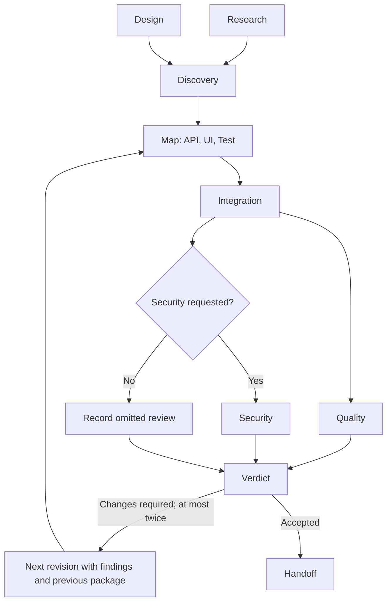

# Flow factory

This example uses a large Jido Flow to coordinate nine real worker Agents.
It produces a software implementation proposal, reviews it, and can run two
repair cycles. It exercises parallel dependencies, ordered Map, nested Flows,
Choice, Iterate, and cross-Agent Signals.

The Mission Agent remains available for inspection and cancellation while its
Plugin runs the Flow. Each worker commits an artifact before the Flow receives
it. The mission records progress through separate Signal turns.

## Run without a key

From the repository root:

```sh
mix run lib/examples/06_factory/06_04_flow_factory/demo.exs
```

The local demonstration produces an initial quality finding, passes that finding
and the previous package to the next build, and accepts revision 1. It completes
with 15 artifacts. Worker output is fixed demonstration text; the Agents, Flow
execution, Signal routing, state commits, and cleanup are real.

Other paths:

```sh
# First review accepts; Choice skips security work.
mix run lib/examples/06_factory/06_04_flow_factory/demo.exs --no-security --accept-after 0

# The second and last allowed repair succeeds.
mix run lib/examples/06_factory/06_04_flow_factory/demo.exs --accept-after 2

# Exhaust both repairs. No handoff runs. The script exits with status 1.
mix run lib/examples/06_factory/06_04_flow_factory/demo.exs --accept-after 3

# Fail an implementation worker. Dependent integration does not start.
mix run lib/examples/06_factory/06_04_flow_factory/demo.exs --fail-role api
```

## Run with the live model

The live option loads the repository `.env` through Dotenvy. Shell environment
values take precedence. Use the existing `OPENAI_API_KEY` and
`FACTORY_MODEL=openai:gpt-4.1-mini` settings:

```sh
mix run lib/examples/06_factory/06_04_flow_factory/demo.exs --live "Design CSV export for a support ticket application"
```

Each worker calls ReqLLM directly. Research and Design produce their own text.
API, UI, and Test receive those artifacts. Integration receives their actual
outputs. Quality and Security return validated JSON reviews. Their verdicts
control repair. Invalid review JSON fails the Flow. Handoff runs only after
both required reviews accept the same build revision.

Live mode does not use the demonstration verdict settings. It can finish on the
first review, request one or two repairs, or fail. It makes at most 21 worker
assignments with security enabled. Each normally uses one model request.
Progress prints as assignments start and
complete; parallel department text is not streamed to one terminal line.

These are proposal artifacts. Workers do not modify a repository, run tests,
search the web, or deploy software. An accepted review is a model's assessment
of the supplied proposal. It is not evidence that software passed tests.

## Work graph



The root [Pipeline](pipeline.ex) contains Discovery and Cycle subflows, a bounded
repair Iterate, and Handoff. Cycle contains the ordered component Map and the
Review subflow. Review contains the security Choice and the verdict join.
The Map preserves API, UI, Test output order even when workers finish in another
order. Research and Design run concurrently. Their outputs are joined before
component work starts. Design is an initial proposal; it does not wait for Research.

The fixed graph permits at most three worker calls at once. `max_concurrency: 3`
is an execution setting for each nested run, not a shared limit across arbitrary
missions. This example starts one Flow and nine workers per Mission Agent.

## Agent and execution boundaries

1. [Mission](mission.ex) commits the goal and `:running` status. It returns spawn
   Directives and a typed Run Directive.
2. [Runner](runner.ex) starts `Jido.Exec.run_async/4` after commit. Its Plugin
   process owns the handle and all runtime context.
3. [AskWorker](pipeline.ex) sends a work Signal to the selected worker. It waits
   for the worker's commit and checks the artifact's assignment ID, role,
   revision, and input hash.
4. Runner forwards progress and final result Signals from one process. This
   preserves their sender order. The Mission Agent commits these events while
   the Flow continues.
5. An accepted final result, a failure, or cancellation stops the worker tree.
   The Mission Agent retains its artifacts and events for inspection.

Worker retries with the same ID and inputs return the committed artifact.
Changed inputs under the same ID are rejected. Each repair has a new revision.
Progress and final results for an inactive or different mission are rejected.

Flow Actions do not return spawn Directives. The outer Mission Action returns
them. Flow failure does not undo completed worker commits or provider calls.
The Flow run has a ten-minute deadline; each worker turn has a 50-second limit.
Repair's nested Exec call receives the remaining mission time. Cancellation
stops both the Flow and worker Agents, since stopping a synchronous caller alone
does not cancel a running worker turn.

This is an in-memory example. It does not checkpoint or resume an active Flow.
Exec handles, client options, API keys, and callbacks stay outside Agent state.
Progress and completion use Agent casts with the core's best-effort overload
behavior. There is no delivery acknowledgement or replay after Plugin failure.
Persistence adapters and recovery are separate work; no database is required.

## Inspect or cancel from IEx

```elixir
alias Jido.Examples.Factory.FlowFactory
{:ok, _} = Jido.start_link(name: MyFlowFactory)
{:ok, mission} = FlowFactory.start(MyFlowFactory, "Design CSV export")

state = FlowFactory.status(mission)
state.status
state.events
state.artifacts

# Once completed:
state = FlowFactory.status(mission)
state.output.mission.review
IO.puts(state.output.handoff.text)

# While running:
FlowFactory.cancel(mission)

# Remove the mission and its runtime resources:
Jido.stop_agent(MyFlowFactory, mission)
```

To use the live mode from IEx, load the environment as in the parent guide and
pass `context: %{mode: :live}` to `start/3`. Each Mission Agent accepts one goal.
Create another Mission Agent for another goal. A chat Agent can use `start/3`,
`status/1`, and `cancel/1` as its tools; this example has a separate shell launcher.

## Tests

```sh
mix test --include example --include integration test/examples/06_factory/06_04_flow_factory
```

The tests use actual Agents and the real Flow runtime. Barriers prove concurrent
entry and dependency joins. They cover repair bounds, omitted security review,
worker errors and crashes, cancellation, shutdown during repair, the complete
deadline, result correlation, and worker retries. Live-path tests use the real
ReqLLM HTTP encoding and parsing with local provider responses. No live key is
needed for tests.

[Tests](../../../../test/examples/06_factory/06_04_flow_factory/flow_factory_test.exs)
· [Results](../../../../docs/examples/flow-factory-results.md)
· [Factory guide](../README.md)
